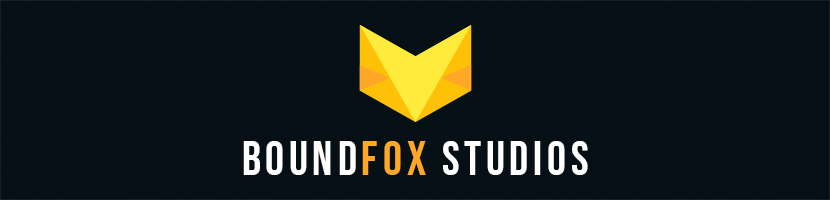
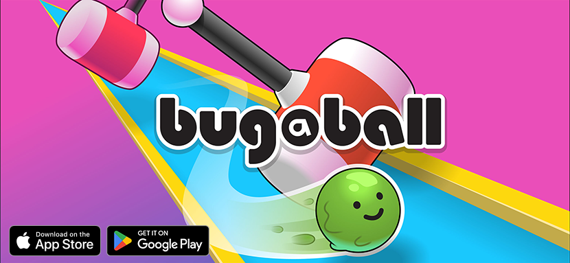

## Hi there 👋

[][1] [][2]

Boundfox Studios is a little Indie Development Studio based in Zweibrücken, Germany.

* We launched [Bug-A-Ball](https://bugaball.com), a little 3D mobile platformer for Android and iOS. 
* We are teaching Game Development on [YouTube][1] in German language.
* We are creating a little [community game](https://github.com/boundfoxstudios/community-project) with Unity.
* We are developing the [FluentAssertions Adapter for Unity](https://github.com/BoundfoxStudios/fluentassertions-unity).

### Our Games

### Social Media

* [YouTube][1]
* [Discord][2]
* [Twitter](https://twitter.com/boundfoxstudios)
* [All other links](https://boundfoxstudios.com/socials/)

<!-- Reference Links -->

[1]: https://youtube.com/c/boundfox
[2]: https://discord.gg/tHqNzMT